  

  

    <strong>Technical Program Management | AI Operations | System Design</strong>
  

  
  
  

 

## 📊 GitHub Statistics

  

 

## 🎓 Education

| Institution | Degree | Timeline |
| :--- | :--- | :--- |
|  | **MS in Computer & Information Technology** | 2025 — 2027 |
|  | **BS in Food Science** | 2020 — 2022 |
|  | **BEng in Food Science & Engineering** | 2018 — 2020 |

 

## 🎯 Career Vision

> **Technical Program Leadership**
> 
> *Merging **multidisciplinary engineering foundations** with modern software architecture. Leveraging a background in Engineering and Biotech to drive complex, cross-functional technical initiatives with high-stakes precision.*

**Path Transition:** `Engineering Scientist` ➔ `Project Management` ➔ `Technical Program Management (TPM)`

 

## 💼 Experience Snapshot

| 🏛️ Previous Life (Domain Expertise) | 🚀 Current Focus (Technical Depth) |
| :--- | :--- |
| **Project Manager** @ Amerigo Scientific | **Technical Program Management** |
| **Clinical Research Coordinator** @ Cornell | **System Design & Architecture** |
| **Associate Scientist** @ Eurofins Lab | **Agentic Workflows & AI Ops** |
| **Domain Expertise:** **Engineering**, Biotech, Food Sci | **Tech Depth:** DSA, Distributed Systems |

 

## 🛠️ Technical Stack

| Category | Tools & Technologies |
| :--- | :--- |
| **Languages** |        |
| **Frontend** |     |
| **Backend** |      |
| **AI & Ops** |      |
| **Engineering & Data** |      |

 

## 🚀 2026 Professional Goals

- **Technical Execution**: Architect and deploy **Oystraz** as a production-ready platform with automated CI/CD pipelines.
- **AI Specialization**: Master autonomous multi-agent orchestration and state management in **Agentic Workflows**.
- **Career Progression**: Successfully execute **Summer 2026 TPM Internship** and secure a full-time return offer.
- **Cross-Functional Leadership**: Author high-impact **Technical Design Docs (TDDs)** to align Engineering and Business stakeholders.
- **Academic Excellence**: Deepen intuition in **Systems Programming (C++)** and Distributed Systems at UPenn.

 

## 🌟 Fun Facts

- 😄 Self-proclaimed "Humor Retriever"
- 🍜 Former food scientist who loves exploring cuisines
- 🏊‍♂️ Swim ~25km/month to stay active
- 🛌 Never stay up late

 

  
   
  <h3>❤️ Looking forward to connecting with and learning from you!</h3>

