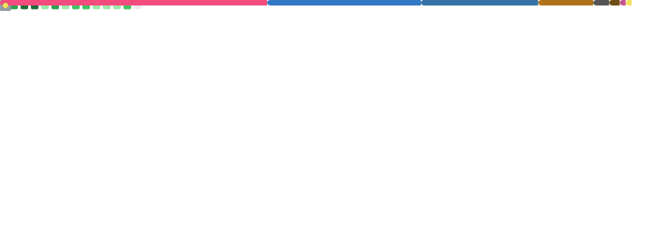

  

  

    <strong>Technical Program Management | AI Operations | System Design</strong>
  

  
  
  

 

## 📊 GitHub Statistics

  

 

## 🎓 Education

| Institution | Degree | Timeline |
| :--- | :--- | :--- |
|  | **MAS in Computer Science** | 2025 — 2027 |
|  | **BS in Food Science** | 2020 — 2022 |
|  | **BEng in Food Science & Engineering** | 2018 — 2020 |

 

## 🎯 Career Vision

> **Technical Program Leadership**
> 
> *Merging **multidisciplinary engineering foundations** with modern software architecture. Leveraging a background in Engineering and Biotech to drive complex, cross-functional technical initiatives with high-stakes precision.*

**Path Transition:** `Engineering Scientist` ➔ `Project Management` ➔ `Technical Program Management (TPM)`

 

## 💼 Experience Snapshot

| 🏛️ Previous Life (Domain Expertise) | 🚀 Current Focus (Technical Depth) |
| :--- | :--- |
| **Project Manager** @ Amerigo Scientific | **Technical Program Management** |
| **Clinical Research Coordinator** @ Cornell | **System Design & Distributed Systems** |
| **Associate Scientist** @ Eurofins Scientific | **Cloud Architecture (AWS SAA Track)** |
| **Domain Expertise:** **Engineering**, Biotech, Food Sci | **Programming:** C++, Java, Python |

 

## 🛠️ Technical Stack

| Category | Tools & Technologies |
| :--- | :--- |
| **Languages** |         |
| **Frontend** |         |
| **Backend** |          |
| **Cloud & DevOps** |        |
| **AI & Ops** |     |
| **Engineering** |         |

 

## 🚀 2026 Professional Goals

- **System Design Mastery**: Deepen expertise in **Distributed Systems**, **System Architecture**, and **Design Patterns**.
- **Cloud & Infrastructure**: Earn **AWS Solutions Architect Associate (SAA)** certification and build scalable cloud solutions.
- **Programming Excellence**: Strengthen technical foundation in **C++**, **Java**, and **Python** for production-grade systems.
- **Project Evolution**: Optimize and extend existing projects with enhanced architecture, CI/CD, and performance tuning.
- **Career Progression**: Excel in **Summer 2026 TPM Internship** and secure full-time return offer.
- **Technical Leadership**: Author impactful **Technical Design Docs (TDDs)** bridging Engineering and Business stakeholders.

 

## 🌟 Fun Facts

- 😄 Self-proclaimed "Humor Retriever"
- 🍜 Former food scientist who loves exploring cuisines
- 🏊‍♂️ Swim ~25km/month to stay active
- 🛌 Never stay up late

 

  
   
  <h3>❤️ Looking forward to connecting with and learning from you!</h3>

